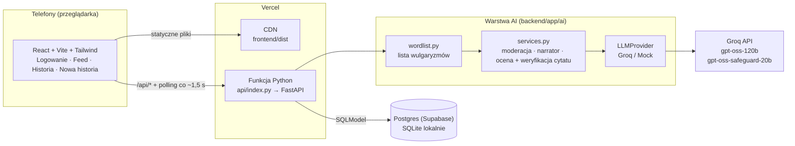
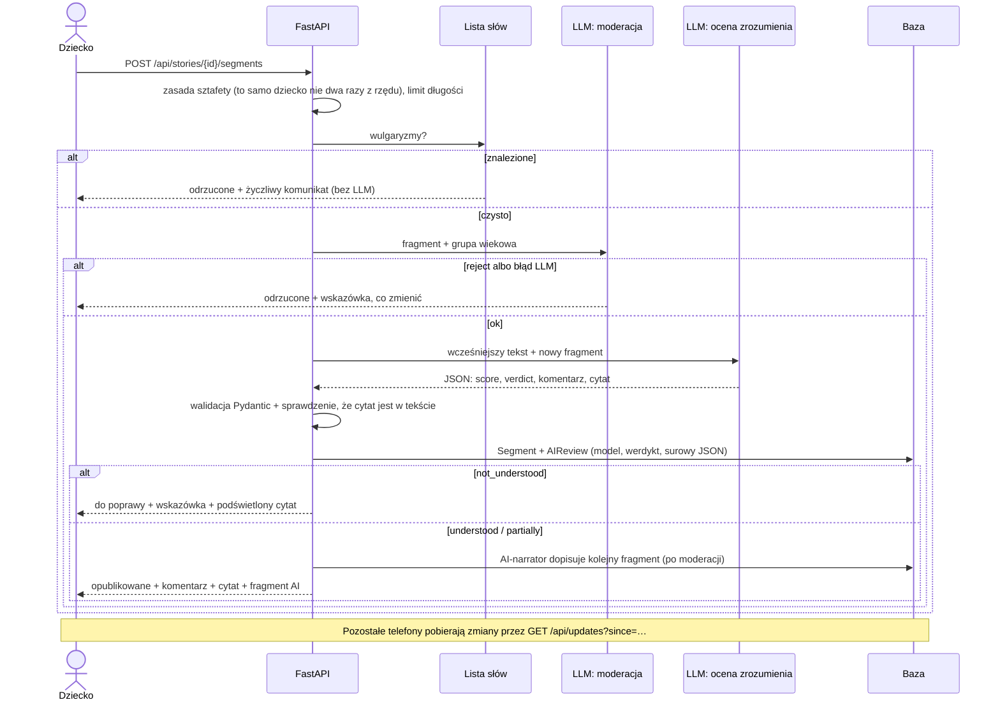

# Sztafeta Słów (Dezanalfabetyzator)

HackYeah 2026 — zadanie otwarte **Artificial Intelligence** · zespół **Drop the Base**

**Demo:** https://sztafeta-slow.vercel.app

Wspólne pisanie historyjek przez dzieci i młodzież (7–18 lat). Dziecko czyta fragment napisany przez kogoś innego (lub przez AI) i dopisuje kontynuację. AI:

1. **moderuje** treści (wulgaryzmy, nieodpowiednie tematy, dane osobowe) przed publikacją,
2. **zaczyna** historie dopasowane do wieku,
3. **sprawdza zrozumienie**: czy kontynuacja nawiązuje do tego, co było wcześniej, i komentuje z cytatem z tekstu.

Każda ocena AI pokazuje cytat z tekstu, na którym się opiera — podświetlony w historii.

- Architektura i decyzje: [`docs/ARCHITECTURE.md`](docs/ARCHITECTURE.md)
- Scenariusz demo na 3 telefony: [`docs/DEMO.md`](docs/DEMO.md)
- Plan prac: [Issues](https://github.com/Drop-the-Base/dezanalfabetyzator/issues)

## Uruchomienie lokalnie
Wymagane: [uv](https://docs.astral.sh/uv/), Node 20+.

```bash
cp .env.example .env          # wpisz GROQ_API_KEY i LLM_PROVIDER=groq (bez klucza działa tryb mock)
npm install && npm run setup  # zależności backendu (uv) i frontendu
npm run demo-reset            # baza z historiami demo
npm run dev                   # backend :8000 + frontend :5173
```
Telefony w tej samej sieci Wi-Fi: `http://<IP-komputera>:5173`.

Inne: `npm test` (testy backendu), `npm run lint`. Po zmianie zależności backendu zaktualizuj też `requirements.txt` (Vercel).
Próba generalna demo przez API: `uv run --project backend python scripts/demo_rehearsal.py <url> --pin=<RESET_PIN>` (reset → scenariusz na historii „Smok…” → reset).

## Architektura



Przepływ dopisania fragmentu:



### Decyzje techniczne
| Decyzja | Uzasadnienie |
|---|---|
| FastAPI + React w monorepo | Python tam, gdzie AI; React = pełna kontrola nad designem mobilnym. |
| Vercel: statyczny frontend + FastAPI jako funkcja Python | Jeden projekt, jeden publiczny HTTPS URL dla 3 telefonów. |
| Polling zamiast WebSocketów | Vercel nie obsługuje WebSocketów; przy ~1,5 s efekt „na żywo” jest taki sam. |
| SQLite lokalnie, Postgres (Supabase) na produkcji | Serverless nie ma trwałego dysku; zmiana bazy = zmiana `DATABASE_URL`. |
| Groq za interfejsem `LLMProvider` + `MockProvider` | Szybka inferencja; dostawcę zmienia się jednym env; mock = testy i praca offline. |
| Moderacja dwuwarstwowa | Lista słów (natychmiast, za darmo) + LLM (kontekst: przemoc, dane osobowe, nękanie). |
| Osobny model do moderacji | Limity Groq są per model — moderacja na `gpt-oss-safeguard-20b` nie zjada limitu modelu oceniającego. |
| JSON + walidacja Pydantic, 1 retry, bezpieczny fallback | Przewidywalne odpowiedzi; błąd moderacji = odrzucenie, nigdy automatyczna akceptacja. |
| Logowanie demo (nick + avatar + wiek) | Brak danych osobowych dzieci (RODO). |

## Ujawnienie użycia AI

**W aplikacji (runtime):**
| Zadanie | Model | Dostawca |
|---|---|---|
| Start historii, ocena zrozumienia | `openai/gpt-oss-120b` | [Groq API](https://console.groq.com) (`groq` SDK, tryb JSON) |
| Moderacja treści | `openai/gpt-oss-safeguard-20b` | Groq API |
| Wulgaryzmy | brak modelu — własna lista słów z normalizacją (`backend/app/ai/wordlist.py`) | — |

Prompty: [`backend/app/ai/prompts/`](backend/app/ai/prompts). Każda decyzja AI jest zapisywana w tabeli `AIReview` (model, werdykt, uzasadnienie, cytat, surowy JSON). Wyniki testu modeli po polsku: [#21](https://github.com/Drop-the-Base/dezanalfabetyzator/issues/21).

**Biblioteki:** backend — FastAPI, SQLModel, Pydantic v2, pydantic-settings, groq, psycopg 3, uvicorn, pytest, ruff; frontend — React 19, React Router 7, Vite 6, Tailwind CSS 4, TypeScript, ESLint. Hosting: Vercel, baza: Supabase Postgres.

**Narzędzia AI przy tworzeniu:** kod, dokumentacja i konfiguracja powstawały z pomocą asystenta programistycznego **Claude Code** (Anthropic; instrukcje dla agenta w [`CLAUDE.md`](CLAUDE.md)). Zespół wyznaczał zakres (issues), przeglądał i scalał zmiany oraz testował aplikację na telefonach.

### Co powstało kiedy
Historia jest w pełni widoczna w `git log` (commity mają znaczniki czasu). W skrócie:
- Plan i dokumentacja (`docs/ARCHITECTURE.md`, `docs/NAZWY.md`, `CLAUDE.md`, issues): commity z 3.10.2026, 20:16–20:44.
- Kod aplikacji (backend, frontend, konfiguracja Vercel, demo): commity od 3.10.2026, 20:55.

## Możliwości i ograniczenia

**Co działa:** wspólne historie „sztafetą” na wielu telefonach jednocześnie, start historii przez AI dla 3 grup wiekowych, moderacja dwuwarstwowa, ocena zrozumienia z cytatem-dowodem, przyjazne komunikaty dla dzieci, tryb offline (mock).

**Jak użytkownik weryfikuje wynik AI:**
- Ocena zrozumienia zawsze wskazuje **dosłowny cytat** z wcześniejszego tekstu. Backend odrzuca cytat, którego nie ma w tekście (ochrona przed halucynacją), a frontend podświetla go w historii — dziecko lub nauczyciel widzi, na czym AI oparło ocenę, i sam ocenia, czy ma ona sens.
- Ocena zrozumienia nigdy nie blokuje: każdy fragment dostaje pochwałę, a mniej spójny — wskazówkę z cytatem i trafia do „Do poprawienia”. Blokuje wyłącznie moderacja (treści obraźliwe i niestosowne).
- Pełny zapis decyzji AI (`GET /api/segments/{id}/reviews`) pozwala sprawdzić model, werdykt i uzasadnienie.

**Ograniczenia:**
- LLM może się mylić w ocenie zrozumienia → to podpowiedź z dowodem, nie stopień.
- Moderacja nie jest w 100% szczelna (np. nowe zakamuflowane formy słów) → dwie warstwy, a przy błędzie LLM fragment jest odrzucany.
- Zależność od zewnętrznego API: darmowy limit Groq to 8000 tokenów/min na model (≈ 6 fragmentów/min) → osobny model do moderacji, fallback `LLM_PROVIDER=mock`.
- Logowanie tylko demonstracyjne (bez haseł) — nie do użytku produkcyjnego w szkole bez prawdziwego uwierzytelniania.
- MVP bez panelu nauczyciela, odwołań od decyzji AI, TTS/STT i odznak.

## Deploy (Vercel)
- Projekt `sztafeta-slow`. Frontend: statyczny build `frontend/dist` (`scripts/vercel-build.sh`); backend: `api/index.py` (FastAPI jako funkcja Python). Konfiguracja w `vercel.json`.
- Zmienne środowiskowe: `LLM_PROVIDER=groq`, `GROQ_API_KEY`, `GROQ_MODEL`, `GROQ_MODERATION_MODEL`, `RESET_PIN`, `SESSION_SECRET`, `POSTGRES_URL` (ustawia integracja Supabase z Vercel Marketplace; pooler w trybie transakcji).
- Bez `POSTGRES_URL`/`DATABASE_URL` aplikacja używa SQLite w `/tmp` — działa, ale dane znikają (tylko do pierwszego testu).
- Dane demo na produkcji: `DATABASE_URL=<neon-url> npm run seed`.
- Diagnostyka: `/api/health` (dostawca LLM), `/api/health/llm` (jedno testowe wywołanie modelu).
